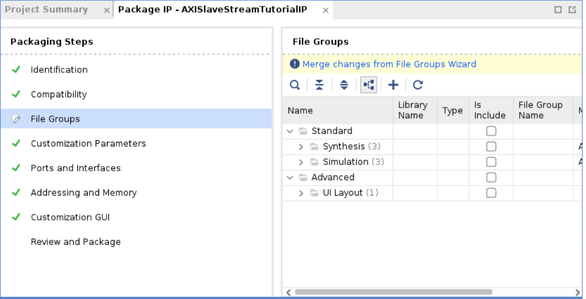

# AXISlaveStreamTutorial

## Purpose

This tutorial is meant for Verilog programmers who want to use the Xilinx ZYNQ 7000 to stream through an AXI Slave Interface. 

## Versions/Equipment:

* PYNQ 2.6 image
* TUL-2 Board 
* Vivado 2021.1 

## Steps 

### Step 1) Build Verilog model 

In this case I took verilog from the AXI Peripherals and edited it to build a simple counting interface. 
There are three modules:

* [TopLevelModule](http://github.com/rogerpease/AXISlaveStreamTutorial/Verilog/module/AXISlaveStreamTutorialIP.v  "Top Level")
* [SlaveStream](http://github.com/rogerpease/AXISlaveStreamTutorial/Verilog/modules/AXISlaveStreamTutorialIP_SlaveStream.v) which takes in an AXI stream and accumulates data. 
* [RegisterFile](http://github.com/rogerpease/AXISlaveStreamTutorial/Verilog/modules/AXISlaveStreamTutorialIP_SlaveRegisterFile.v) which interfaces to the CPU to return summed results.   

### Step 2) Package IP

The simplest way to package the IP through the gui is:

1. git clone http://github.com/rogerpease/AXISlaveStreamTutorial 
1. cd AXISlaveStreamTutorial 
1. Start Vivado and Create a new project. Call it whatever you want and you can ignore the steps about adding IP/selecting parts/boards. 
1. Tools->Create and Package New IP and select "Package a Specific Directory". Click Next.
1. Select the AXISlaveStreamTutorial directory and Click Next.
1. Enter a project name and click next. 
1. It should figure out the AXI interfaces and the hierarchy.  All you should need to do is:
	1. Click "File Groups" in the Package IP window.  
        1. fill in the names of the IP and User and click 'Package IP'. 

These steps are captured for automation in the [RunPackageIP.py](http://github.com/rogerpease/AXISlaveStreamTutorial/RunPackageIP.py) script.  

### Step 3) Make an FPGA Image and instance the IP 

1. Start Vivado and Create a new RTL project (I call mine FPGAImageProject). 
	- You don't need to add RTL source but be sure to select your board from the board/part menu.
1. Click "Project Manager"->"Settings"->"IP" and add your IP directory from the prior step as a IP Repository. It should find the IP even in a subdirectory.
1. Click "Create Block Design" and make a new Block design.  
1. Add the AXISlaveStreamTutorial directory as an IP Repository. It should find one directory.  
1. Add the following:
	1. ZYNQ 7000 
	1. "AXI Direct Memory Access" 
	1. AXISlaveStreamTutorialIP 
1. Run "Run Block Automation" (should be an option in a ribbon at the top of the Block Diagram). 
1. Double-Click on the ZYNQ 7000:
 	1. Select "PS-PL Configuration"->"HP Slave AXI Interface"->"S AXI HP0 interface" to include a Slave High Performance Port. 
     	1. If you select "Run Block Automation" you may need to reselect this.
1. Double-Click on the AXI Direct Memory Access Peripheral to:
	1. Remove the Write Channel 
	1. Turn off Scatter-Gather 
1. Run "Run Connection Automation" and select "All Automation". 
	1. You may need to hand draw a connection from axi_dma_0/M_AXIS_MM2S to AXISlaveStreamTutorial/slavestream.
	1. It should look like this:  
1. Go to the "FPGA Image" sources area and click "Generate HDL Wrapper". The tool that makes the netlists can't read a Block Diagram. 
	1.  
1. Make sure:
	1. The AXI Direct Memory Access M_AXIS_MM2S connects to the AXISlaveStreamTutorial IP slavestream interface. This is what writes the stream data.   
	1. The AXI Slave Tutorial IP has all its resets and clocks connected. They can be connected to the other resets/clocks (respectively).  
1. Run "Generate Bitstream" and wait for the bitstream to generate. 

You should find a bit file and hwh file in your directory (you may need to do a find for files ending in those extensions).

These steps are captured for automation in the [RunMakeImage.py](http://github.com/rogerpease/AXISlaveStreamTutorial/RunMakeImage.py) script.  

### Step 4) Upload FPGA Image to your ZYNQ

I normally upload to /home/xilinx/AXISlaveStreamTutorial 

There is a [SendStream.py](http://github.com/rogerpease/AXISlaveStreamTutorial/SendStream.py) script which will:
1. Stream in numbers to the streaming interface. *BE SURE TO RUN THE SCRIPT AS ROOT* 
1. Those numbers are summed together and the result is placed in the Register File. 
1. The total is read back the sum through the register file. 

The copy steps are captured for automation in the [PushFiles.py](http://github.com/rogerpease/AXISlaveStreamTutorial/PushFiles.py) script. Be sure to update the IP address of your board.   
